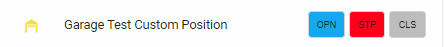
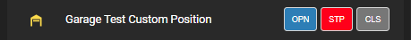
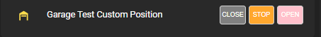

# cover-control-button-row
button row for controlling open/close covers in Home Assistant. This plugin will also accept a "cover group" as the entity_id.

This element is completely theme-able to provide a match to the other control rows to provide a consistent look for the different elements in your Lovelace frontend

Installation:

The easiest way to install this is to use the Home Assistant Community Store (HACS) in Home Assistant.

Follow the instructions there for installation making sure you note the "url:" section for the resources addition.


Conversely, if you don't use HACS you can install it manually by performing the following:

Copy the cover-control-button-row.js file to the appropriate folder in your Home Assistant Configuration directory (/config/www/).

Place the following in your "resources" section in your lovelace configuration (updating the localation to where you placed the above file):

  ```
    - url: /local/cover-control-button-row.js
      type: module
  ```
    
Then to use this in a card place the following in your entity card:

<b>Options:</b>

| Name | Type | Required | Default | Description |
| --- | --- | --- | --- | --- |
| type | String | Yes | none | custom:cover-position-entity-row |
| entity | String | Yes | none | Any positional cover entity_id (including "cover group" entities) |
| name | String | No | none | A custom name for the entity in the row |
| customTheme | Boolean | No | false | Set to true to use a custom theme |
| reverseButtons | Boolean | No | false | Set to true to reverse the button order |
| isOpenColor | String | No | '#f44c09' | Sets the color of the 'open' button if cover is fully open |
| isClosedColor | String | No | '#43A047' | Sets the color of the 'closed' button if cover is closed |
| stopButtonColor | String | No | '#c94444' | Sets the color of the 'open' button if cover is fully open |
| buttonInactiveColor | String | No | '#759aaa' | Sets the color of the the buttons if that selection is not "active" |
| customOpenText | String | No | 'OPN' | Sets the text of the "open" control button |
| customStopText | String | No | 'STP' | Sets the text of the "stop" control button |
| customCloseText | String | No | 'CLS' | Sets the text of the "close" control button |


The values for the colors can be any valid color string in "HEX", "RGB" or by color name.

If the cover position is changed via any other means (slider, service call, etc) the buttons will indicate positions correctly.

This plugin can also be used with a group of positionable covers by creating a "cover group". Then each cover in the group will be simultaneously controlled by the plugin.

<b>Configuration Examples:</b>
    
  ```
    cards:
      - type: entities
        title: cover theme test
        show_header_toggle: false
        state_color: true
        entities:
          - type: custom:cover-control-button-row
            name: Garage Door
            entity: cover.garage_door
            reverseButtons: true
            ## used to select your own customizable theme
            customTheme: true
            stopButtonColor: 'orange'
            buttonInactiveColor: 'gray'
            isOpenColor: 'pink'
            isClosedColor: 'magenta'
            ## used to select custom text for the buttons
            customOpenText: 'OPEN'
            customStopText: 'STOP'
            customCloseText: 'CLOSE'
  ```

This is with the default Lovelace frontend theme set:



This is with the "Slate" frontend theme set:



This is with a custom theme and custom text:



